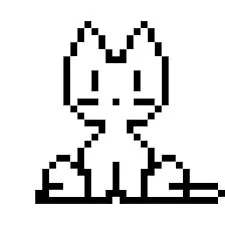

# hugo-neko

[](https://github.com/ystepanoff/hugo-neko)
[](LICENSE)



A Hugo module that adds a cat that follows your mouse pointer around the page; it leverages a [Git submodule](https://github.com/ystepanoff/oneko.js) to 
include the accompanying JavaScript logic and the GIF image.

Original JS script author: Ariana @ https://adryd.com, https://github.com/adryd325/oneko.js

## Installation

### 1. Get the `hugo-neko` module
```bash
hugo mod get github.com/ystepanoff/hugo-neko@latest
```

### 2. Import the module

Edit your site's `hugo.toml` (or `hugo.yaml/hugo.json` depending on your configuration format) to import the module.
```toml
# hugo.toml

[module]
    [[module.imports]]
        path = "github.com/ystepanoff/hugo-neko"
```

```yaml
# hugo.yaml

module:
  imports:
    - path: "github.com/ystepanoff/hugo-neko"
```

```json
// hugo.json

{
  "module": {
    "imports": [
      {
        "path": "github.com/ystepanoff/hugo-neko"
      }
    ]
  }
}

```


### 3. Initialise Hugo modules
```bash
hugo mod tidy
```

## Usage

### 1. As a partial
```gohtml
{{ partial "hugo-neko/oneko.html" . }}
```

### 2. As a shortcode
```gohtml

```

## Contact
For any questions, issues, or feature requests, please open an [issue](https://github.com/ystepanoff/hugo-neko/issues).
